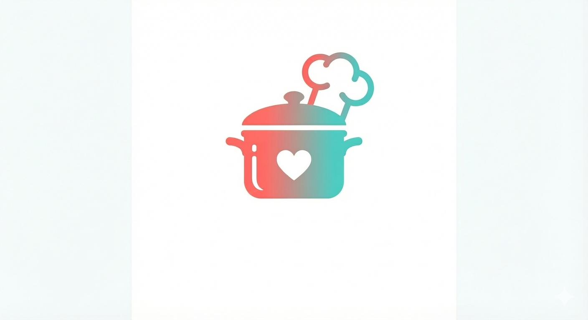

<div align="center">



# PantryPal

**A full-featured personal recipe manager built with React 19**

Discover, save, and organise thousands of recipes. Plan your meals for the week, generate smart shopping lists, and build beautiful custom cookbooks — all in one place.

[](https://react.dev)
[](https://vitejs.dev)
[](https://zustand-demo.pmnd.rs)
[](LICENSE)

[Features](#-features) · [Tech Stack](#-tech-stack) · [Getting Started](#-getting-started) · [Project Structure](#-project-structure) · [Architecture](#-architecture) · [Roadmap](#-roadmap)

</div>

---

## Overview

PantryPal is a single-page React application that gives home cooks a complete recipe management toolkit. It connects to the free [TheMealDB API](https://www.themealdb.com) to provide access to over 10,000 recipes, and persists all user data locally using Zustand with `localStorage`, so everything is always available — no account required.

The interface is fully responsive: a fixed sidebar on desktop, and a slide-in hamburger drawer with a top app-bar on mobile and tablet.

---

## Features

### Recipe Discovery
- Browse a curated grid of random featured recipes on the home page, refreshed on every visit
- Full-text search across 10,000+ recipes powered by TheMealDB
- Detailed recipe view with ingredients, step-by-step instructions, and a YouTube tutorial link where available

### Personal Library
- **Favourites** — save any recipe with a single tap; persists across sessions
- **My Recipes** — create and store custom recipes with your own name, category, cuisine, and instructions
- **Recently Viewed** — automatically tracks the last 12 recipes you opened, shown on the home page for quick re-access

### Meal Planning
- 7-day visual meal planner showing the current week
- Assign breakfast, lunch, dinner, and snack slots for any day
- Pick from your saved favourites directly inside the planner
- Remove planned meals individually with a single click

### Smart Shopping List
- Add all ingredients from any recipe in one tap from the recipe detail page
- Add items manually with the inline quick-add input — no need to be on a recipe page
- Items are automatically categorised by type (Produce, Meat, Dairy, Pantry, Spices, Other)
- Check off items as you shop; clear checked items in bulk
- Print the list directly from the browser

### Cookbooks
- Group your favourite recipes into named cookbook collections
- Visual 2×2 thumbnail grid preview for each cookbook
- Delete cookbooks at any time without affecting your underlying favourites

### UI & Experience
- Light and dark mode with a single toggle, persisted across sessions
- Responsive layout: sidebar navigation on desktop (≥769px), slide-in drawer + fixed top header on mobile/tablet (≤768px)
- Smooth drawer animation with backdrop blur and scroll-lock while open
- Non-blocking toast notifications for actions like saving to shopping list or copying a share link
- Web Share API integration on supported devices; clipboard fallback on others

---

## Tech Stack

| Layer | Technology |
|---|---|
| Framework | React 19 |
| Bundler | Vite 7 |
| State management | Zustand 5 with `persist` middleware |
| Routing | React Router DOM 7 |
| Icons | Lucide React |
| Data source | TheMealDB REST API (free tier, no key required) |
| Styling | CSS-in-JS via `<style>` tag with CSS custom properties |
| Fonts | Sora (display) + DM Sans (body) via Google Fonts |
| Storage | `localStorage` via Zustand persist |

---

## Getting Started

### Prerequisites

- [Node.js](https://nodejs.org) **v18 or higher** (LTS recommended)
- npm (bundled with Node.js)

Verify your installation:

```bash
node -v
npm -v
```

### Installation

**1. Clone or unzip the project**

If you have the zip file:
```bash
unzip pantrypal-v2.zip
cd pantrypal-updated
```

Or clone from your repository:
```bash
git clone https://github.com/your-username/pantrypal.git
cd pantrypal
```

**2. Install dependencies**

```bash
npm install --legacy-peer-deps
```

> The `--legacy-peer-deps` flag is required because `lucide-react@0.383.0` declares peer support for React 16–18, while this project uses React 19. The library works correctly with React 19; the flag bypasses the version check.

**3. Start the development server**

```bash
npm run dev
```

Open [http://localhost:5173](http://localhost:5173) in your browser.

### Available Scripts

| Command | Description |
|---|---|
| `npm run dev` | Start development server with HMR at `localhost:5173` |
| `npm run build` | Build for production into the `dist/` folder |
| `npm run preview` | Serve the production build locally for final checks |
| `npm run lint` | Run ESLint across all source files |

### Production Build

```bash
npm run build
npm run preview
```

The `dist/` directory contains a fully static build that can be deployed to any static host (Vercel, Netlify, GitHub Pages, etc.).

---

## Project Structure

```
pantrypal/
├── public/
│   ├── favicon.png
│   └── logo.png
├── src/
│   ├── App.jsx               # Main application — all components, pages, store, and styles
│   └── main.jsx              # React root render
├── index.html
├── package.json
├── vite.config.js
└── README.md
```

> All application code lives in `src/App.jsx`. This is an intentional architectural decision for a project of this scope — a single-file approach eliminates module resolution overhead, keeps imports minimal, and makes the entire codebase readable in one file. See [Architecture](#-architecture) for more detail.

---

## Architecture

### State Management

PantryPal uses [Zustand](https://zustand-demo.pmnd.rs) with the `persist` middleware. All user data — favourites, custom recipes, the meal plan, the shopping list, cookbooks, recently viewed recipes, and the UI theme — is stored in a single Zustand store that automatically syncs to `localStorage`.

```
useRecipeStore (Zustand + persist → localStorage)
├── favorites[]
├── myRecipes[]
├── shoppingList[]
├── mealPlan{}                 // keyed by ISO date string, then meal slot
├── cookbooks[]
├── recentlyViewed[]           // capped at 12 entries, LIFO
└── theme: 'light' | 'dark'
```

Because all state is derived from the store, there is no prop drilling and no shared context — any component can read or write any slice directly.

### Data Fetching

All external data comes from the [TheMealDB free API](https://www.themealdb.com/api.php). There is no backend, no authentication, and no API key needed. The three endpoints in use are:

```
GET /api/json/v1/1/search.php?s={query}   → search by name
GET /api/json/v1/1/lookup.php?i={id}      → fetch single recipe
GET /api/json/v1/1/random.php             → random recipe
```

The home page fires 8 parallel random requests using `Promise.all` to populate the featured grid.

### Routing

Client-side routing is handled by React Router DOM 7. All routes are declared in the root `<App>` component:

| Route | Page |
|---|---|
| `/` | Home (featured recipes + recently viewed) |
| `/search` | Recipe search |
| `/recipe/:id` | Recipe detail |
| `/favorites` | Saved favourites |
| `/my-recipes` | Custom recipes |
| `/meal-planner` | 7-day meal planner |
| `/shopping-list` | Shopping list |
| `/cookbook` | Cookbook collections |

### Responsive Layout Strategy

| Viewport | Navigation |
|---|---|
| ≥ 769px (desktop) | Fixed 248px sidebar with full nav |
| 769px–1024px (tablet) | Sidebar narrows to 200px |
| ≤ 768px (mobile/tablet) | Sidebar hidden; fixed top header with hamburger; slide-in drawer |

The drawer uses a CSS `transform: translateX(-100%)` → `translateX(0)` transition driven by an `open` boolean in local React state. A backdrop overlay sits behind it on `z-index: 300`; the drawer itself is on `z-index: 400`. Body scroll is locked via `document.body.style.overflow = 'hidden'` while the drawer is open, and restored on close or route change.

### Shopping List Categorisation

When ingredients are added to the shopping list, the `getCategoryForIngredient` utility performs a simple keyword match against a predefined map:

```
Produce   → lettuce, tomato, onion, garlic, pepper, carrot, potato, celery
Meat      → chicken, beef, pork, lamb, turkey, bacon, sausage
Dairy     → milk, cheese, butter, cream, yogurt, eggs
Pantry    → flour, sugar, salt, pepper, oil, vinegar, rice, pasta
Spices    → cumin, paprika, oregano, basil, thyme, cinnamon
Other     → fallback for unmatched ingredients
```

Manually added items go through the same categorisation pipeline.

---

## Environment & Compatibility

PantryPal requires no environment variables. The TheMealDB API is public and runs over HTTPS, so there is nothing to configure before running the project.

| Browser | Support |
|---|---|
| Chrome / Edge 90+ | ✅ Full |
| Firefox 90+ | ✅ Full |
| Safari 15+ | ✅ Full |
| iOS Safari 15+ | ✅ Full |
| Chrome for Android | ✅ Full |

The Web Share API (used on the recipe detail share button) is available on iOS Safari, Chrome for Android, and recent versions of Chrome/Edge on desktop. On unsupported browsers, the button falls back to copying the URL to the clipboard.

---

## Roadmap

Features planned for future development:

- [ ] **Nutritional information** — calorie and macro display on recipe detail, using a nutrition API
- [ ] **Category & cuisine filters** — filter chips on the search page to narrow results by meal type or origin
- [ ] **Serving size scaling** — scale ingredient quantities dynamically based on the servings stepper
- [ ] **Recipe notes** — personal freetext notes attached to any saved recipe
- [ ] **Cookbook PDF export** — generate a printable PDF from a cookbook collection
- [ ] **Recipe ratings** — star rating system for saved recipes
- [ ] **Cloud sync** — optional account-based sync so data follows the user across devices

---

## Contributing

Contributions are welcome. Please open an issue to discuss significant changes before submitting a pull request.

1. Fork the repository
2. Create a feature branch: `git checkout -b feature/your-feature-name`
3. Commit your changes: `git commit -m 'feat: add your feature'`
4. Push to the branch: `git push origin feature/your-feature-name`
5. Open a pull request against `main`

Please follow the existing code style. Run `npm run lint` before submitting.

---

## License

This project is licensed under the [MIT License](LICENSE).

---

## Acknowledgements

- Recipe data provided by [TheMealDB](https://www.themealdb.com) — a free, open, crowd-sourced database of recipes
- Icons by [Lucide](https://lucide.dev)
- Typography: [Sora](https://fonts.google.com/specimen/Sora) and [DM Sans](https://fonts.google.com/specimen/DM+Sans) via Google Fonts

---

<div align="center">

Built with care by **Eniola Omoniyi**

</div>